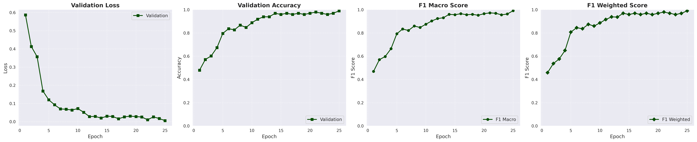

# Sheep Classification Challenge

A computer vision project to classify Arabian sheep breeds from images using machine learning. Built for a cultural challenge celebrating Eid al-Adha.


## How to install

1. Clone this reop

```bash
git clone git@github.com:ahmedsalim3/sheep-classification-challenge.git
cd sheep-classification-challenge
```
2. Install dependencies

```sh
make install
```

## Configuration

Edit YAML files in `configs/` to configure the paths, output directories, and training parameters:

- [paths.yml](./configs/config.yml) -

## Dataset

The dataset can be found on [Kaggle](https://www.kaggle.com/competitions/sheep-classification-challenge-2025/data).
You can also download it by running `make download-data`. Make sure to configure your Kaggle credential paths [here](./scripts/download_dataset.sh#L11)

## Training

```sh
make train
# or python scripts/train.py
```

## Results

```bash
Cross-validation results:
Mean F1: 0.9576 ± 0.0158
Individual fold scores: [0.9610855046521297, 0.9314436885865457, 0.9517947495203616, 0.9792646410961358, 0.9646165120085449]
```

The full results can be found [here](./results/)


## Team Structure and Contribution

[@ahmedsalim3](https://github.com/ahmedsalim3)

## References

[Eid Al-Adha 2025: Sheep Classification Challenge](https://www.kaggle.com/competitions/sheep-classification-challenge-2025/overview)
