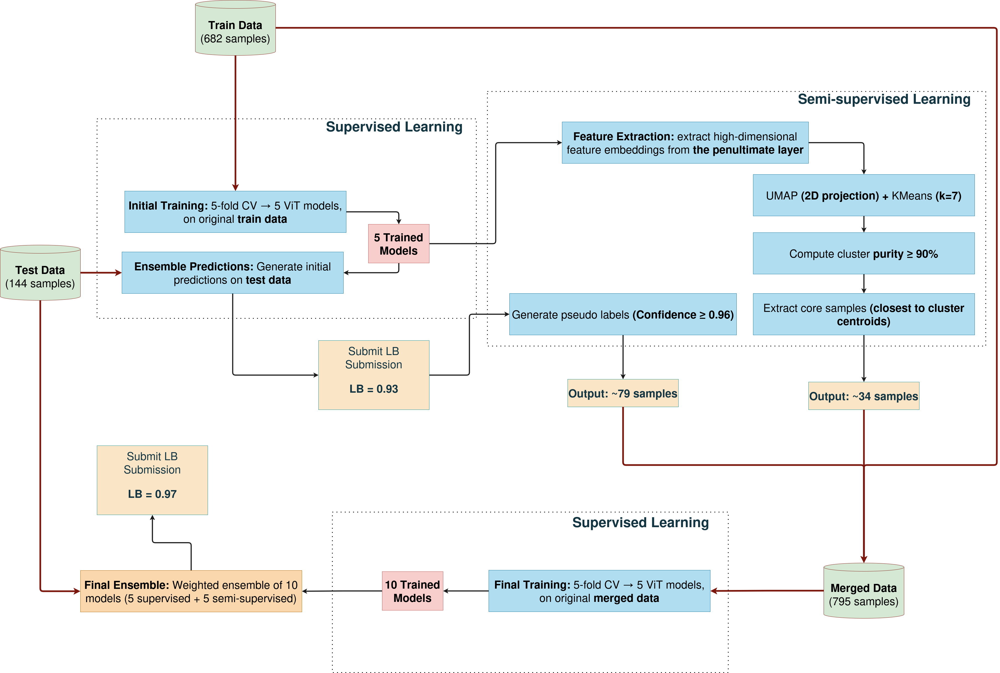

# Sheep Classification Challenge

A deep learning solution for classifying sheep breeds using semi-supervised learning. The project tackles a small, imbalanced dataset with smart data mining techniques and Vision Transformers, achieving **0.97 F1-score** on the [Kaggle Sheep Classification Challenge 2025](https://www.kaggle.com/competitions/sheep-classification-challenge-2025/overview)



👉 Check the [project page](https://ahmedsalim3.github.io/sheep-classification-challenge/), it walks through everything: training strategy, tricks used, and what worked (and what didn't)

## Challenge Overview

The goal was to classify 7 sheep breeds using just **682 labeled images** with significant class imbalance and visually noisy data. The evaluation metric was F1-score, making this a particularly challenging task

**Key Challenges:**
- Extremely small dataset (682 images)
- High class imbalance across 7 breeds
- Visually noisy images with poor quality
- F1-score evaluation requiring balanced precision/recall

## Solution Approach

Our solution employs a **semi-supervised learning pipeline** built around Vision Transformers (ViT) with intelligent data mining techniques:

### 1. Initial Training
- **5-fold cross-validation** on clean labeled data
- Vision Transformer (ViT) architecture with differential learning rates
- Focal Loss + Effective Class Weights (β=0.9999) for imbalance handling
- CosineAnnealingWarmRestarts scheduler with early stopping

### 2. Pseudo-labeling
- Ensemble predictions on unlabeled test set (144 images)
- **Strict confidence threshold (≥ 0.96)** for quality control
- Extracted ~79 high-confidence pseudo-labeled samples

### 3. Clustering-based Data Mining
- **K-Means clustering** on ViT feature embeddings with UMAP dimensionality reduction
- **Purity threshold (≥ 0.9)** for cluster filtering
- Extracted ~34 high-quality core samples from unlabeled data

### 4. Final Training
- Combined dataset: 682 clean + ~113 synthetic samples = ~795 total
- **~79% of test set utilized** through pseudo-labeling and clustering
- Ensemble of 10 models (5 initial + 5 final)
- Weighted ensemble using cross-validation scores

## 📊 Results & Performance

| Metric | Value |
|--------|-------|
| **Best Kaggle F1-Score** | **0.97** |
| **Dataset Expansion** | 682 + ~113 synthetic samples → ~795 total |
| **Unlabeled Data Utilization** | ~79% (113/144 test images) |
| **High-Confidence Pseudo-labels** | ~79 samples |
| **Clustered Core Samples** | ~34 samples |
| **Model Ensemble Size** | 10 models |

## 🛠️ Installation

1. Clone this repo

```bash
git clone git@github.com:ahmedsalim3/sheep-classification-challenge.git
cd sheep-classification-challenge
```

2. Install dependencies

```sh
make install
```

## ⚙️ Configuration

Edit YAML file in [`config.yml`](./configs/config.yml) to configure the paths, output directories, and training parameters

## 📁 Dataset

The dataset is hosted on [Kaggle](https://www.kaggle.com/competitions/sheep-classification-challenge-2025/data).

To download it automatically:

```sh
make download-data
```

Make sure your Kaggle credentials are set correctly [here](./scripts/download_dataset.sh#L11)

## 🏋️ Training

The project supports two training modes:

### Cross-Validation Training

For robust model evaluation with k-fold cross-validation:

```sh
python scripts/train.py --use_cross_validation
```

### Normal Training

For faster training with train/validation split:

```sh
python scripts/train.py --val_split 0.2
```

### Custom Validation Split

```sh
python scripts/train.py --val_split 0.3
```

It supports clean training, pseudo-labeling, clustering, and full semi-supervised loops

## 📈 Results

All final logs, metrics, and plots can be found inside the [results](./results/) folder

## 🔗 Resources

- **[GitHub Repository](https://github.com/ahmedsalim3/sheep-classification-challenge)**
- **[Kaggle Notebook](https://www.kaggle.com/code/ahvshim/fix-the-data-first-then-worry-about-the-model)**
- **[Competition Page](https://www.kaggle.com/competitions/sheep-classification-challenge-2025)**
- **[Discussion](https://www.kaggle.com/competitions/sheep-classification-challenge-2025/discussion/585744)**

## 📁 Repo Structure

```sh
sheep-classification-challenge/
├── src/
│   ├── modeling/         # Training, evaluation, clustering
│   ├── data/             # Dataset, transforms, pseudo-labeling
│   └── utils/            # Helpers and utilities
├── scripts/
│   ├── train.py          # Unified training script
│   ├── train_cv.sh       # Cross-validation training
│   ├── train_normal.sh   # Normal training
│   └── download_dataset.sh
├── configs/              # Configuration files
├── notebooks/            # Jupyter notebooks
├── docs/                 # Documentation and assets
└── results/              # Training outputs and metrics
```

## 📚 References

[Eid Al-Adha 2025: Sheep Classification Challenge](https://www.kaggle.com/competitions/sheep-classification-challenge-2025/overview)

[Fix The Data First, Then Worry About The Model](https://www.kaggle.com/code/ahvshim/fix-the-data-first-then-worry-about-the-model/notebook)
